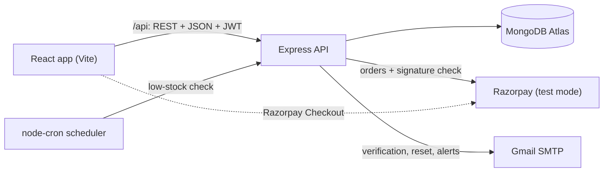
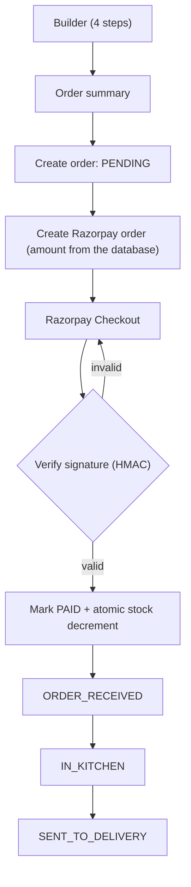

<div align="center">

# 🍕 Slice & Co. — Pizza Delivery Full-Stack App

**Build your own pizza, pay online, and watch it move from the kitchen to your door — with a staff side that keeps the stock honest.**


**Oasis Infobyte Internship (OIBSIP) — Web Development & Designing, Level 3**


</div>

## Table of contents

- [Overview](#overview)
- [Features](#features)
- [Screenshots](#screenshots)
- [Demo video](#demo-video)
- [Architecture](#architecture)
- [Tech stack](#tech-stack)
- [Project structure](#project-structure)
- [Getting started](#getting-started)
- [Environment variables](#environment-variables)
- [Scripts](#scripts)
- [API overview](#api-overview)
- [How the main pieces work](#how-the-main-pieces-work)
- [Testing](#testing)
- [Known limitations](#known-limitations)
- [Troubleshooting](#troubleshooting)
- [Deployment (optional)](#deployment-optional)
- [Documentation](#documentation)
- [Author](#author)

## Overview

Slice & Co. is a pizza ordering and inventory management web application with two roles. **Customers** register, verify their email, build a pizza step by step (or customise a preset), pay with Razorpay in test mode and follow the order as it progresses. **Admins** (restaurant staff) sign in separately to manage ingredient stock, receive automatic low-stock emails and move paid orders through the kitchen. The backend is the source of truth for prices, stock, payment state and order status; the browser only displays and requests.

## Features

### 🧑 Customer
- Registration with an **email verification** link, JWT login, and **forgot / reset password** by email
- **Pizza menu**: six preset pizzas with photo, ingredients and a ₹ price computed by the server
- **4-step custom builder**: base, sauce, cheese (exactly one) and vegetables (any number), with a progress stepper and a running total; **Customize** pre-selects a preset's ingredients
- **Order summary** with itemised prices, quantity (1–5) and total before paying
- **Order history** and order detail with a three-step progress tracker that refreshes by **polling** (every 5 seconds)

### 🛠️ Admin
- Separate **staff login** (`/admin/login`); there is no way to register as admin
- **Inventory dashboard** for four categories (bases, sauces, cheeses, vegetables) with OK / Low stock / Out of stock badges
- **Manual stock updates** (set a value, `+10`, `+50`) that are **race-safe**: an edit made from a stale view is refused with 409 and the current value is shown
- **Configurable low-stock threshold** per item, and activate / deactivate
- **Scheduled low-stock email alerts** (`node-cron`): one digest per run, no repeats while an item stays in the same state
- **Order management** with a forward-only status flow: Order Received → In Kitchen → Sent to Delivery

### 💳 Payments
- **Razorpay test-mode** order creation and checkout (test keys only; live keys are refused)
- **Server-side HMAC signature verification**; an order is confirmed only after a verified payment
- **Idempotent confirmation**: repeating the verification never takes stock twice
- **Atomic stock decrement** after payment: all-or-nothing, never below zero

### 🔒 Security
- **bcrypt** password hashing and **JWT** authentication, with the user re-read from the database on every request
- **Role-based authorization enforced on the server** (customer routes reject admins, admin routes reject customers)
- **zod** validation on request bodies (unknown fields are rejected), **rate limiting**, **helmet** and CORS
- **Hashed, single-use, expiring tokens** for email verification and password reset
- **No account enumeration**: reset and resend endpoints give the same answer whether or not the account exists

## Screenshots

<table>
  <tr>
    <td align="center"><br><sub><b>Customer login</b></sub></td>
    <td align="center"><br><sub><b>Dashboard with six preset pizzas</b></sub></td>
  </tr>
  <tr>
    <td align="center"><br><sub><b>4-step pizza builder</b></sub></td>
    <td align="center"><br><sub><b>Order summary with itemised prices</b></sub></td>
  </tr>
  <tr>
    <td align="center"><br><sub><b>Admin dashboard</b></sub></td>
    <td align="center"><br><sub><b>Inventory with a Low stock badge</b></sub></td>
  </tr>
</table>

The Razorpay checkout, admin orders and order tracking screens are not pictured: they need a paid order, and a live test payment could not be made from the author's network (see [Known limitations](#known-limitations)).

## Demo video

A walkthrough of the application is on my LinkedIn: **[LINKEDIN_POST_URL](LINKEDIN_POST_URL)**

## Architecture



**Order flow**



## Tech stack

| Layer | Technology | Purpose |
| --- | --- | --- |
| Frontend | React 19, Vite, React Router, Axios | Single-page app, routing, API calls |
| Backend | Node.js, Express 5 | REST API |
| Database | MongoDB Atlas, Mongoose | Users, ingredients/inventory, pizzas, orders |
| Payments | Razorpay (test mode) | Order creation, checkout, signature verification |
| Email | Nodemailer (Gmail SMTP) | Verification, password reset, low-stock alerts |
| Scheduling | node-cron | Periodic low-stock check |
| Security | bcryptjs, jsonwebtoken, zod, helmet, express-rate-limit, CORS | Auth, validation and API hardening |
| Testing & tooling | Node's built-in test runner, oxlint | Automated tests, linting |

## Project structure

```
WebDev-L3-PizzaDelivery/
├── client/                  React app (Vite)
│   └── src/
│       ├── pages/           One file per screen (Builder, OrderSummary, AdminInventory, ...)
│       ├── components/      Reusable UI (OptionGroup, OrderTracker, InventoryRow, ...)
│       ├── services/        API calls (axios)
│       ├── context/ hooks/  Auth state, polling hook
│       └── layouts/         Page shell (navbar, footer)
├── server/
│   ├── src/
│   │   ├── routes/          URL -> controller wiring
│   │   ├── controllers/     Request handlers
│   │   ├── services/        Pricing, payments, inventory, low-stock job, email
│   │   ├── models/          Mongoose schemas (User, Order, Pizza, InventoryItem)
│   │   ├── middleware/      Auth, rate limits, error handler
│   │   ├── validators/      zod schemas
│   │   ├── scripts/         seedMenu, seedAdmin, resetAdminPassword
│   │   └── config/          Environment and database setup
│   └── tests/               Automated API tests
├── docs/                    API reference, requirements matrix, testing notes, checklists
├── screenshots/             Images used in this README
└── tools/demo-video/        Optional Playwright + ffmpeg demo/screenshot tooling
```

## Getting started

### Prerequisites
- Node.js 20 or newer and npm
- A free MongoDB Atlas cluster and its connection string (nothing to install locally)
- For the full flow: a Gmail account with an **App Password** (emails) and Razorpay **test-mode** API keys (payments)

### 1. Clone
```bash
git clone https://github.com/Zaira-Shahid/OIBSIP.git
cd OIBSIP/WebDev-L3-PizzaDelivery
```

### 2. Install dependencies
```bash
cd server && npm install
cd ../client && npm install
```

### 3. Configure the server
```bash
cd ../server
cp .env.example .env     # Windows PowerShell: Copy-Item .env.example .env
```
Fill in `server/.env` (see [Environment variables](#environment-variables)). **Never commit this file**; it is git-ignored. In Atlas, create a database user and add your IP under *Network Access*.

### 4. Seed the database (safe to run again)
```bash
npm run seed:menu     # ingredients (bases, sauces, cheeses, vegetables) and the six preset pizzas
npm run seed:admin    # the admin account from ADMIN_EMAIL / ADMIN_PASSWORD
```

### 5. Run both dev servers
```bash
# terminal 1, in server/
npm run dev           # API on http://localhost:5000

# terminal 2, in client/
npm run dev           # app on http://localhost:5173
```

| What | URL |
| --- | --- |
| App | http://localhost:5173 |
| API health check | http://localhost:5000/api/health |
| Staff login | http://localhost:5173/admin/login (also linked in the footer) |

The Vite dev server proxies `/api` to the backend. No demo credentials are committed: register a customer on the site, and sign in as admin with the `ADMIN_EMAIL` / `ADMIN_PASSWORD` you seeded. To use admin and customer at once, open one of them in a private window (the login is kept per browser profile).

Razorpay test card: `4111 1111 1111 1111`, any future expiry, any CVV and name.

## Environment variables

All are read from `server/.env` (template: `server/.env.example`). The client needs none.

| Variable | Required | Description |
| --- | --- | --- |
| `MONGODB_URI` | **Yes** | MongoDB Atlas connection string |
| `JWT_SECRET` | **Yes** | Signs login tokens; at least 32 random characters |
| `JWT_EXPIRES_IN` | No | Token lifetime, default `1d` |
| `PORT` | No | API port, default `5000` |
| `NODE_ENV` | No | `development` (default), `production` or `test` |
| `CLIENT_URL` | No | CORS origin and base of links in emails, default `http://localhost:5173` |
| `ADMIN_EMAIL`, `ADMIN_PASSWORD` | For the admin | Used by `seed:admin` and `admin:reset-password` (password: 8–72 characters with a letter and a number) |
| `EMAIL_HOST`, `EMAIL_PORT` | No | SMTP server, default `smtp.gmail.com` / `587` |
| `EMAIL_USER`, `EMAIL_PASSWORD` | For real email | Gmail address and **App Password**. Without them, development prints each email (with its link) to the server console |
| `EMAIL_FROM` | No | Sender address; defaults to `EMAIL_USER` |
| `ADMIN_ALERT_EMAIL` | No | Where low-stock emails go; falls back to `ADMIN_EMAIL` |
| `LOW_STOCK_CHECK_CRON` | No | How often stock is checked (cron expression), default `*/15 * * * *` |
| `RAZORPAY_KEY_ID`, `RAZORPAY_KEY_SECRET` | For payments | Razorpay **test** keys only (`rzp_test_…`). Until both are set, paying returns "Online payments are not configured yet" |

## Scripts

**`server/`**

| Script | What it does |
| --- | --- |
| `npm run dev` | Start the API with nodemon (auto-restart) |
| `npm start` | Start the API with Node |
| `npm test` | Run the automated test suite (separate test database) |
| `npm run seed:menu` | Load/upgrade ingredients, inventory and preset pizzas |
| `npm run seed:admin` | Create the admin account (never overwrites a password) |
| `npm run admin:reset-password` | Set a new password for the admin in `ADMIN_EMAIL` |

**`client/`**

| Script | What it does |
| --- | --- |
| `npm run dev` | Start the Vite dev server |
| `npm run build` | Production build into `dist/` |
| `npm run lint` | Lint with oxlint |
| `npm run preview` | Serve the production build locally |

## API overview

Base URL `http://localhost:5000/api`. Responses are `{ success, data | message }`. The full reference with bodies and status codes is in [docs/API.md](WebDev-L3-PizzaDelivery/docs/API.md).

| Method | Endpoint | Access | Purpose |
| --- | --- | --- | --- |
| GET | `/health` | Public | API and database status |
| POST | `/auth/register` | Public | Create a customer; sends the verification email |
| GET | `/auth/verify-email?token=` | Public | Verify an email address (single-use token) |
| POST | `/auth/resend-verification` | Public | Resend the verification email |
| POST | `/auth/login` | Public | Customer login, returns a JWT |
| GET | `/auth/me` | Logged in | Current user |
| POST | `/auth/forgot-password` | Public | Email a reset link |
| POST | `/auth/reset-password` | Public | Set a new password with a reset token |
| GET | `/pizzas`, `/pizzas/:id` | Public | Preset pizzas with server-computed prices |
| POST | `/pizzas/price` | Public | Price a custom pizza |
| GET | `/ingredients` | Public | Ingredients by category, with availability |
| POST | `/orders` | Customer | Create an unpaid order (amount computed by the server) |
| GET | `/orders`, `/orders/:id` | Customer | Order history and detail (tracking) |
| POST | `/orders/:id/payment` | Customer | Create the Razorpay order for payment |
| POST | `/payments/verify` | Customer | Verify the Razorpay signature, confirm the order, decrement stock |
| POST | `/admin/login` | Public | Staff login |
| GET | `/admin/orders` | Admin | Paid orders, newest first |
| PATCH | `/admin/orders/:id/status` | Admin | Advance an order one step |
| GET | `/admin/orders/refunds` | Admin | Payments awaiting a manual refund |
| POST | `/admin/orders/:id/mark-refunded` | Admin | Mark a refund as done |
| GET | `/admin/inventory` | Admin | All inventory items, grouped, with status |
| PATCH | `/admin/inventory/:id` | Admin | Set stock, `adjustBy`, threshold, active |
| POST | `/admin/inventory/check-low-stock` | Admin | Run the low-stock check now |

## How the main pieces work

### Payments (Razorpay test mode)

1. "Proceed to pay" creates an unpaid order; the server then creates a Razorpay order for the stored amount (in paise) and the browser opens Razorpay Checkout.
2. After payment the browser sends the three checkout values to `POST /api/payments/verify`. The server checks the signature, moves the order to `PAID`, takes the stock (`stock >= quantity` for each ingredient, atomically, all-or-nothing) and only then sets the status to Order Received. A repeated verify never takes stock twice.
3. Closing the checkout window leaves the order unpaid; paying again creates a fresh Razorpay order.


### Menu and prices

The six menu pizzas are presets: each is a list of builder ingredients, and **Customize** opens the builder with them already selected. A preset has no price of its own: the price on its card is the sum of the current prices of its ingredients, calculated by the server, so it always equals what the builder charges. `npm run seed:menu` is safe to re-run at any time and also upgrades a database seeded by an older version: it only changes a record that still holds exactly what the old seed wrote, so your own edits to stock, prices, descriptions or defaults are kept.


### Low-stock email alerts

A `node-cron` job checks stock on the `LOW_STOCK_CHECK_CRON` schedule and emails **one digest** listing every ingredient that newly became low (stock below its own threshold) or out of stock. An item is emailed once per state: again only if it gets worse (low to out of stock), or after it was restocked to its threshold and later drops again. The inventory page has a **Run low-stock check now** button for demos; it runs the same job with the same rules. The server logs one line per run, for example `[low-stock] checked 21 items, alerted 2`.


### Admin account

- Staff sign in at `/admin/login` (linked as "Staff login" in the footer). Customers cannot use it and admins cannot use the customer login. Everything under `/api/admin` (except that login) requires a valid admin token, checked against the database on every request.
- `seed:admin` never overwrites a password. To **change the admin password**, put the admin's email in `ADMIN_EMAIL` and the new password in `ADMIN_PASSWORD`, then run `npm run admin:reset-password` in `server`. It updates only that account, applies the password rule, refuses a non-admin email, and signs out every older admin session. There is no email-based admin reset by design.

## Testing

```bash
cd server && npm test
```
The automated suite (157 tests) runs against a separate `pizza-delivery-test` database and cleans up after itself. Payment tests use a fake Razorpay gateway, email tests a fake mail transport, and the scheduler tests a fake cron library, so no real money, email or cron job is involved. One test waits for MongoDB's real TTL cleanup, so a full run takes a few minutes. Client checks: `cd client && npm run lint && npm run build`. Manual checklists: [docs/TESTING.md](WebDev-L3-PizzaDelivery/docs/TESTING.md).

## Known limitations

- **Razorpay could not be exercised live from the author's network.** Razorpay's API (`api.razorpay.com`) answers every request from Pakistan with HTTP 406, so `POST /api/orders/:id/payment` fails there with a 502 and no live test payment could be made at the end of the project. Order creation, checkout, HMAC signature verification, stock decrement and status tracking are implemented and covered by the automated tests, which use a **mocked gateway**. Live payment, live tracking and the stock decrement after a real payment were therefore **not demonstrated** in the demo video or screenshots. On a network where `api.razorpay.com` is reachable (see Troubleshooting) the flow is expected to work as it did in earlier manual checks.
- **Email delivery depends on valid SMTP credentials.** At the time of the final recording the Gmail App Password in the author's `server/.env` was rejected by Gmail (`535 BadCredentials`), so verification, reset and low-stock emails could not be sent or demonstrated. The email code is covered by the automated tests (mocked transport). Create a new App Password and set `EMAIL_PASSWORD` to use real email.
- **Paid but out of stock (rare race).** If an ingredient runs out between the payment-start check and a successful payment, stock cannot be taken. The order stays `paymentStatus: PAID` with **no** order status, is flagged for a refund, and the customer is told they will be refunded. The refund itself is **manual** (Razorpay dashboard): the admin Orders screen lists these payments (with the Razorpay payment id) under "Needs a manual refund", and the admin marks each one once refunded.
- **No Razorpay webhook.** Confirmation relies on the browser returning from checkout. If the browser closes after paying but before verification, the payment is not auto-confirmed. A webhook needs a publicly reachable URL and is outside the task requirements.
- Unpaid orders (abandoned checkouts) are deleted automatically 24 hours after creation by a MongoDB TTL index that only covers `PENDING`/`FAILED` orders; a paid order is never deleted.
- Order tracking uses polling (a few seconds' delay), not WebSockets.
- The login token is kept in `localStorage`.

## Troubleshooting

- **`querySrv ECONNREFUSED` on startup** - Node's DNS resolver can fail the `mongodb+srv://` lookup on some networks even when the OS resolves it. The server detects this specific failure and retries once with Google/Cloudflare public DNS. Alternatives: set your OS DNS to 8.8.8.8, or use Atlas's standard (non-SRV) `mongodb://` connection string.
- **"Could not connect to any servers"** - add your IP under Atlas *Network Access*.
- **Emails are not arriving** - use a Gmail *App Password* (Google account > Security > 2-Step Verification > App passwords), not your normal password, and check the spam folder. Without SMTP settings in development the link is printed in the server console.
- **Payments say "not configured"** - set both Razorpay test keys in `server/.env` and restart the server.
- **Razorpay API may reject requests from some regions (HTTP 406)** - use a network/VPN where `api.razorpay.com` is reachable. Check with `curl -i https://api.razorpay.com/v1/orders`: a `401` with a JSON body means it is reachable; a `406` means your network is blocked.
- **The menu looks empty** - run `npm run seed:menu` in `server`.

## Deployment (optional)

> **Not required for OIBSIP.** The project is graded from the repository and the demo video, and runs fully on `localhost`. This section is a guide only; nothing here has been deployed or tested by the project author.

A common free setup is **Vercel** (client) + **Render** (server) + **MongoDB Atlas** (database):

1. **Atlas:** keep the cluster you already use. Under *Network Access* allow the server's outbound addresses (Render free instances do not have fixed IPs, so `0.0.0.0/0` is the usual choice there; do not leave that open on a database holding real data).
2. **Server on Render:** create a *Web Service* from the repository. Root directory `WebDev-L3-PizzaDelivery/server`, build command `npm install`, start command `npm start`. Set the same variables as your local `server/.env`, plus `NODE_ENV=production` and `CLIENT_URL=<your Vercel URL>` (used for CORS and the links in emails). Run `npm run seed:menu` and `npm run seed:admin` once against the production database (for example from your computer with `MONGODB_URI` pointing at it).
3. **Client on Vercel:** import the same repository. Root directory `WebDev-L3-PizzaDelivery/client`, framework Vite, build command `npm run build`, output directory `dist`. The app calls the API at the relative path `/api`, which only the Vite dev server proxies, so add a `vercel.json` in the client folder that forwards it and keeps client-side routes working:
   ```json
   {
     "rewrites": [
       { "source": "/api/:path*", "destination": "https://YOUR-SERVICE.onrender.com/api/:path*" },
       { "source": "/(.*)", "destination": "/index.html" }
     ]
   }
   ```
4. **Things to know:** Render's free tier puts an idle service to sleep, and a sleeping server does not run the low-stock cron job, so scheduled alerts are unreliable there (the first request after a nap is also slow). Razorpay stays in **test mode** (`rzp_test_` keys only).

## Documentation

- [API reference](WebDev-L3-PizzaDelivery/docs/API.md)
- [Requirements & traceability](WebDev-L3-PizzaDelivery/docs/REQUIREMENTS.md)
- [Testing notes](WebDev-L3-PizzaDelivery/docs/TESTING.md)
- [Demo checklist](WebDev-L3-PizzaDelivery/docs/DEMO-CHECKLIST.md) · [Demo video script](WebDev-L3-PizzaDelivery/docs/VIDEO-SCRIPT.md) · [LinkedIn post draft](WebDev-L3-PizzaDelivery/docs/LINKEDIN-POST.md)
- [Submission checklist](WebDev-L3-PizzaDelivery/docs/SUBMISSION-CHECKLIST.md)
- [Master specification](WebDev-L3-PizzaDelivery/docs/OIBSIP_WebDev_Level3_PizzaDelivery_Master_Spec.md)

## Author

**Zaira Shahid** — Web Development & Designing intern, Oasis Infobyte (OIBSIP), Level 3.  
GitHub: [@Zaira-Shahid](https://github.com/Zaira-Shahid) · Repository: [Zaira-Shahid/OIBSIP](https://github.com/Zaira-Shahid/OIBSIP)

This repository has no licence file, so all rights are reserved by the author.
