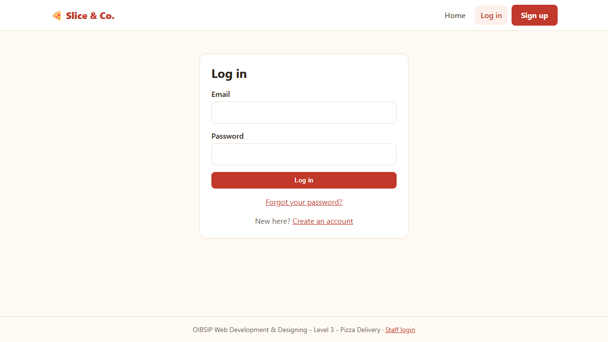
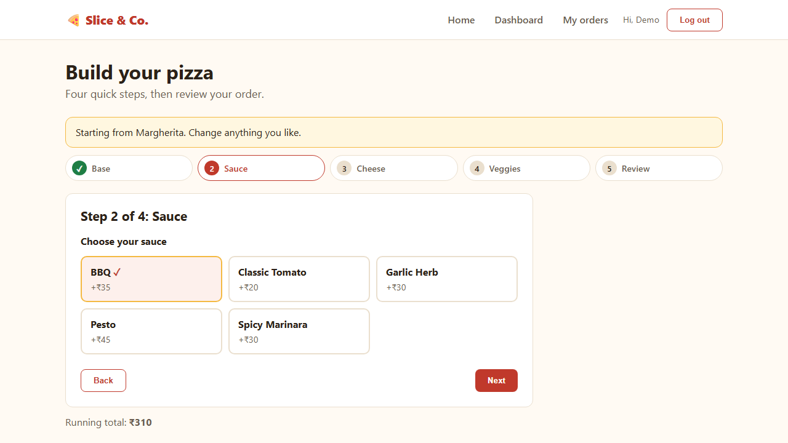
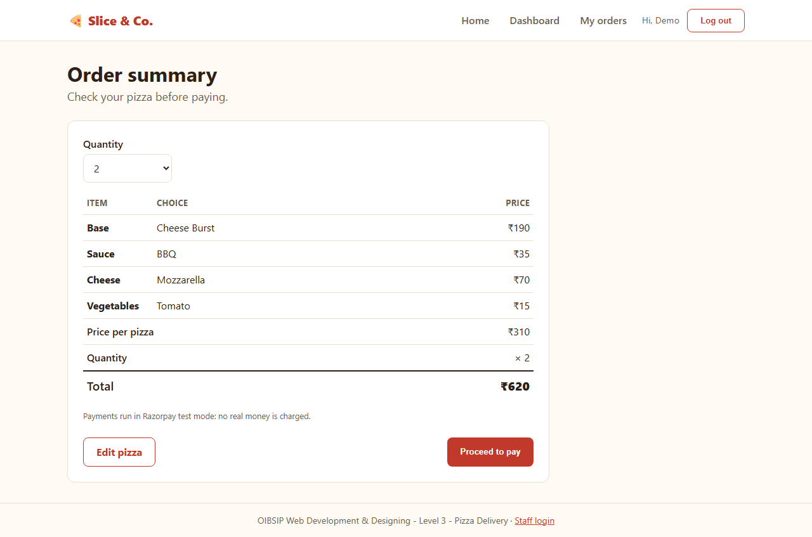
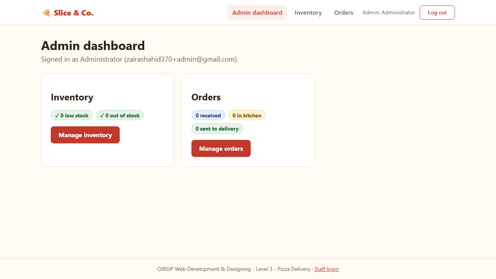
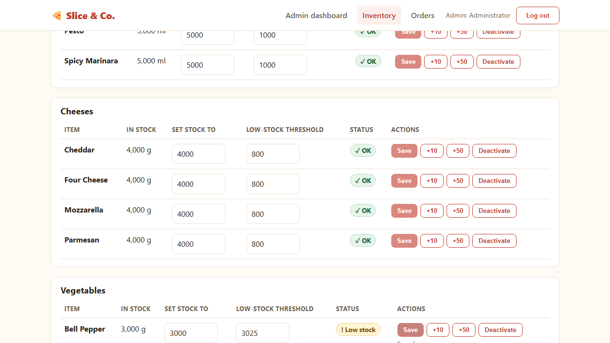

# Pizza Delivery - Full-Stack Application

**Project:** Slice & Co. - Pizza Delivery
**Program:** Oasis Infobyte Summer Internship Program (OIBSIP)
**Track:** Web Development & Designing · **Level:** 3 · **Task:** 1 - Pizza Delivery Full-Stack Application
**Author:** Zaira Shahid

A pizza ordering and inventory management web application with separate customer and admin roles. Customers register (with email verification), build a pizza step by step, pay with Razorpay (test mode) and follow the order live. Admins manage stock and orders, and receive an automatic email when ingredients run low.

## Features

### User (customer)
- Registration with an **email verification** link, JWT login, and **forgot / reset password** by email
- **Pizza dashboard** with six preset pizzas (photo, ingredients and a ₹ price)
- **Custom pizza builder** in four steps: base (5 options), sauce (5 options), cheese (exactly one of 4) and vegetables (any number); progress indicator, back/next with validation, selections kept when going back, and a final summary
- **Customize** on a preset opens the builder with its ingredients pre-selected; **Build your own pizza** starts empty
- **Order summary** with an itemised breakdown (base, sauce, cheese, vegetables, price per pizza, quantity 1-5, total) before paying
- **My orders** and order details with a three-step progress tracker

### Payment
- **Razorpay checkout in test mode** (test keys only; live keys are refused by the server)
- The server recomputes every price from the database and verifies the Razorpay signature; the order is only confirmed after a verified payment
- Closing the checkout window leaves the order retryable; repeating the verification never charges stock twice

### Admin
- Separate **staff login** (`/admin/login`); there is no way to register as admin, and every admin route is protected on the server
- **Orders** screen: paid orders with customer, pizza choices, quantity, amount and payment state, and a button for the one legal next status (Order Received → In Kitchen → Sent to Delivery)
- A **"Needs a manual refund"** list for the rare case of a payment that could not be confirmed
- Dashboard overview with order counts per status and low / out-of-stock counts

### Inventory
- Stock for **bases, sauces, cheeses and vegetables**, with a status badge (OK / Low stock / Out of stock)
- **Manual stock updates** (set a value, or `+10` / `+50`), per-item **low-stock threshold**, and activate/deactivate
- Stock is **decremented automatically** when an order is paid, atomically and never below zero
- **Scheduled low-stock email** (`node-cron`): one digest per run, no repeat emails while an item stays in the same state

### Real-time tracking
- Customers' order pages refresh by themselves every 5 seconds (polling), so a status change made by the admin appears without reloading; polling pauses in a hidden tab and stops when the page is left
- The admin Orders screen and dashboard refresh every 10 seconds

## Tech stack

- **React.js** (Vite, React Router) - frontend
- **Node.js** and **Express.js** - REST API
- **MongoDB** (Atlas) with Mongoose - database
- **Razorpay** (test mode) - payments
- JWT + bcrypt - authentication; zod - input validation; helmet, CORS and rate limiting - API hardening
- **Nodemailer** (Gmail SMTP) + **node-cron** - emails and the scheduled low-stock job

## Architecture

```
React frontend (client/)
      ↓  /api  (REST, JSON, JWT)
Express API (server/)
      ↓
MongoDB Atlas
      ↓
External services: Razorpay (test mode), Gmail SMTP
```

The backend is the source of truth for prices, stock, payment state and order status; the browser only displays and requests. See [docs/API.md](docs/API.md) for every endpoint.

## Repository layout

```
OIBSIP/
└── WebDev-L3-PizzaDelivery/
    ├── client/        React app
    ├── server/        Express API (src/, tests/)
    ├── docs/          API reference, requirements matrix, testing notes, demo and submission checklists
    ├── screenshots/   Screenshots used below
    └── README.md
```

## Setup

### 1. Prerequisites
- Node.js 20 or newer and npm
- A free MongoDB Atlas cluster and its connection string (nothing to install or start locally)
- Optional but needed for the full flow: a Gmail account with an **App Password** (for emails) and a Razorpay account's **test-mode** API keys (for payments)

### 2. Clone the repository
```bash
git clone https://github.com/Zaira-Shahid/OIBSIP.git
cd OIBSIP/WebDev-L3-PizzaDelivery
```

### 3. Install the frontend dependencies
```bash
cd client && npm install
```

### 4. Install the backend dependencies
```bash
cd ../server && npm install
```

### 5. Configure `server/.env`
```bash
cp .env.example .env     # on Windows PowerShell: Copy-Item .env.example .env
```
Fill in `server/.env`. **Never commit this file** (it is git-ignored).

| Variable | Required | Purpose |
| --- | --- | --- |
| `MONGODB_URI` | yes | Atlas connection string |
| `JWT_SECRET` | yes | Signs login tokens (at least 32 random characters) |
| `JWT_EXPIRES_IN` | no | Token lifetime, default `1d` |
| `PORT` | no | API port, default `5000` |
| `CLIENT_URL` | no | CORS origin and base of the links in emails, default `http://localhost:5173` |
| `ADMIN_EMAIL`, `ADMIN_PASSWORD` | for the admin | Used by `npm run seed:admin` and `npm run admin:reset-password` (password: 8-72 characters with a letter and a number) |
| `EMAIL_HOST`, `EMAIL_PORT`, `EMAIL_USER`, `EMAIL_PASSWORD`, `EMAIL_FROM` | for real email | Gmail SMTP with an App Password. Without `EMAIL_USER`/`EMAIL_PASSWORD`, development prints each email (including its link) to the server console instead |
| `ADMIN_ALERT_EMAIL` | no | Where low-stock emails go; falls back to `ADMIN_EMAIL` |
| `LOW_STOCK_CHECK_CRON` | no | How often stock is checked, as a cron expression; default `*/15 * * * *`. Use `*/1 * * * *` for a one-minute demo |
| `RAZORPAY_KEY_ID`, `RAZORPAY_KEY_SECRET` | for payments | Razorpay **test** keys only (`rzp_test_...`). Until both are set, paying returns "Online payments are not configured yet" |

### 6. Database
There is nothing to start locally: MongoDB runs in Atlas. In Atlas, create a database user and add your IP address under *Network Access*. Then load the menu and the admin account (both commands are safe to run again):
```bash
npm run seed:menu     # ingredients (bases, sauces, cheeses, vegetables) and the six preset pizzas
npm run seed:admin    # the admin account from ADMIN_EMAIL / ADMIN_PASSWORD
```

### 7. Start the backend
```bash
npm run dev           # http://localhost:5000  (check http://localhost:5000/api/health)
```

### 8. Start the frontend (second terminal)
```bash
cd client && npm run dev      # http://localhost:5173
```
The Vite dev server proxies `/api` to the backend.

## Test accounts

No demo credentials are committed to this repository. Create your own:
- **Customer:** register on the site and open the verification link from the email (check the spam folder).
- **Admin:** set `ADMIN_EMAIL` and `ADMIN_PASSWORD` in `server/.env`, run `npm run seed:admin`, then use the *Staff login* link in the footer.
- **Razorpay test card:** `4111 1111 1111 1111`, any future expiry date, any CVV and name.

## Screenshots

| | |
| --- | --- |
| **Login**  | **User dashboard**  |
| **Pizza builder**  | **Order summary**  |
| **Razorpay test checkout**  | **Admin dashboard**  |
| **Inventory**  | **Order management**  |
| **Order tracking**  | |

## Using the admin and a customer at the same time

The browser keeps one login per browser profile, so signing in as admin replaces a customer session in the same window. To use both at once (for example to watch live tracking), open the admin in a **private/incognito window** and the customer in a normal window; they do not share storage.

## Payments (Razorpay test mode)

1. "Proceed to pay" creates an unpaid order; the server then creates a Razorpay order for the stored amount (in paise) and the browser opens Razorpay Checkout.
2. After payment the browser sends the three checkout values to `POST /api/payments/verify`. The server checks the signature, moves the order to `PAID`, takes the stock (`stock >= quantity` for each ingredient, atomically, all-or-nothing) and only then sets the status to Order Received. A repeated verify never takes stock twice.
3. Closing the checkout window leaves the order unpaid; paying again creates a fresh Razorpay order.

## Menu and prices

The six menu pizzas are presets: each is a list of builder ingredients, and **Customize** opens the builder with them already selected. A preset has no price of its own: the price on its card is the sum of the current prices of its ingredients, calculated by the server, so it always equals what the builder charges. `npm run seed:menu` is safe to re-run at any time and also upgrades a database seeded by an older version: it only changes a record that still holds exactly what the old seed wrote, so your own edits to stock, prices, descriptions or defaults are kept.

## Low-stock email alerts

A `node-cron` job checks stock on the `LOW_STOCK_CHECK_CRON` schedule and emails **one digest** listing every ingredient that newly became low (stock below its own threshold) or out of stock. An item is emailed once per state: again only if it gets worse (low to out of stock), or after it was restocked to its threshold and later drops again. The inventory page has a **Run low-stock check now** button for demos; it runs the same job with the same rules. The server logs one line per run, for example `[low-stock] checked 21 items, alerted 2`.

## Admin account

- Staff sign in at `/admin/login` (linked as "Staff login" in the footer). Customers cannot use it and admins cannot use the customer login. Everything under `/api/admin` (except that login) requires a valid admin token, checked against the database on every request.
- `seed:admin` never overwrites a password. To **change the admin password**, put the admin's email in `ADMIN_EMAIL` and the new password in `ADMIN_PASSWORD`, then run `npm run admin:reset-password` in `server`. It updates only that account, applies the password rule, refuses a non-admin email, and signs out every older admin session. There is no email-based admin reset by design.

## Tests

```bash
cd server && npm test
```
The automated suite runs against a separate `pizza-delivery-test` database and cleans up after itself. Payment tests use a fake Razorpay gateway, email tests a fake mail transport, and the scheduler tests a fake cron library, so no real money, email or cron job is involved. One test waits for MongoDB's real TTL cleanup, so a full run takes a few minutes. Client checks: `cd client && npm run lint && npm run build`. Manual checklists: [docs/TESTING.md](docs/TESTING.md).

## Known limitations

- **Paid but out of stock (rare race).** If an ingredient runs out between the payment-start check and a successful payment, stock cannot be taken. The order stays `paymentStatus: PAID` with **no** order status, is flagged for a refund, and the customer is told they will be refunded. The refund itself is **manual** (Razorpay dashboard): the admin Orders screen lists these payments (with the Razorpay payment id) under "Needs a manual refund", and the admin marks each one once refunded.
- **No Razorpay webhook.** Confirmation relies on the browser returning from checkout. If the browser closes after paying but before verification, the payment is not auto-confirmed. A webhook needs a publicly reachable URL and is outside the task requirements.
- Unpaid orders (abandoned checkouts) are deleted automatically 24 hours after creation by a MongoDB TTL index that only covers `PENDING`/`FAILED` orders; a paid order is never deleted.
- Order tracking uses polling (a few seconds' delay), not WebSockets.
- The login token is kept in `localStorage`.

## Troubleshooting

- **`querySrv ECONNREFUSED` on startup** - Node's DNS resolver can fail the `mongodb+srv://` lookup on some networks even when the OS resolves it. The server detects this specific failure and retries once with Google/Cloudflare public DNS. Alternatives: set your OS DNS to 8.8.8.8, or use Atlas's standard (non-SRV) `mongodb://` connection string.
- **"Could not connect to any servers"** - add your IP under Atlas *Network Access*.
- **Emails are not arriving** - use a Gmail *App Password* (Google account > Security > 2-Step Verification > App passwords), not your normal password, and check the spam folder. Without SMTP settings in development the link is printed in the server console.
- **Payments say "not configured"** - set both Razorpay test keys in `server/.env` and restart the server.
- **The menu looks empty** - run `npm run seed:menu` in `server`.

## Deployment (optional)

> **Not required for OIBSIP.** The project is graded from the repository and the demo video, and runs fully on `localhost`. This section is a guide only; nothing here has been deployed or tested by the project author.

A common free setup is **Vercel** (client) + **Render** (server) + **MongoDB Atlas** (database):

1. **Atlas:** keep the cluster you already use. Under *Network Access* allow the server's outbound addresses (Render free instances do not have fixed IPs, so `0.0.0.0/0` is the usual choice there; do not leave that open on a database holding real data).
2. **Server on Render:** create a *Web Service* from the repository. Root directory `WebDev-L3-PizzaDelivery/server`, build command `npm install`, start command `npm start`. Set the same variables as your local `server/.env`, plus `NODE_ENV=production` and `CLIENT_URL=<your Vercel URL>` (used for CORS and the links in emails). Run `npm run seed:menu` and `npm run seed:admin` once against the production database (for example from your computer with `MONGODB_URI` pointing at it).
3. **Client on Vercel:** import the same repository. Root directory `WebDev-L3-PizzaDelivery/client`, framework Vite, build command `npm run build`, output directory `dist`. The app calls the API at the relative path `/api`, which only the Vite dev server proxies, so add a `vercel.json` in the client folder that forwards it and keeps client-side routes working:
   ```json
   {
     "rewrites": [
       { "source": "/api/:path*", "destination": "https://YOUR-SERVICE.onrender.com/api/:path*" },
       { "source": "/(.*)", "destination": "/index.html" }
     ]
   }
   ```
4. **Things to know:** Render's free tier puts an idle service to sleep, and a sleeping server does not run the low-stock cron job, so scheduled alerts are unreliable there (the first request after a nap is also slow). Razorpay stays in **test mode** (`rzp_test_` keys only).

## Docs

- [API reference](docs/API.md)
- [Requirements & traceability](docs/REQUIREMENTS.md)
- [Testing notes](docs/TESTING.md)
- [Demo checklist](docs/DEMO-CHECKLIST.md) · [Demo video script](docs/VIDEO-SCRIPT.md) · [LinkedIn post draft](docs/LINKEDIN-POST.md)
- [Submission checklist](docs/SUBMISSION-CHECKLIST.md)
- [Master specification](docs/OIBSIP_WebDev_Level3_PizzaDelivery_Master_Spec.md)
